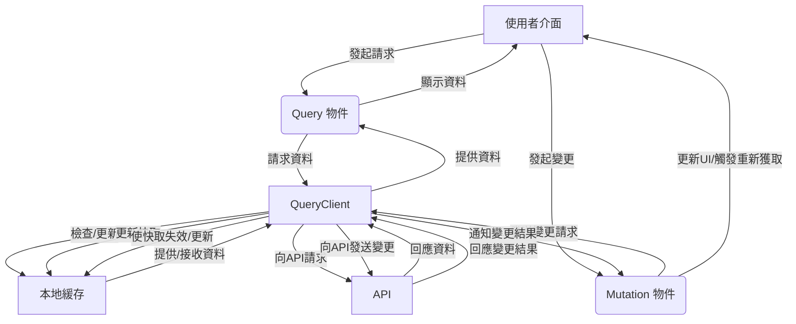

# 5. TanStack Query 資料流圖解 (角色定義版)

為了更精確地說明 TanStack Query 在 SvelteKit 應用程式中的資料流，我們將明確定義並展示以下六個核心角色之間的交互關係：

1.  **API**：外部資料來源。
2.  **本地緩存 (Local Cache)**：TanStack Query 內部管理的資料儲存區。
3.  **QueryClient**：TanStack Query 的核心管理器。
4.  **使用者介面 (UI)**：應用程式的顯示層。
5.  **Query 物件 (createQuery)**：負責資料查詢。
6.  **Mutation 物件 (createMutation)**：負責資料變更。

### 角色說明與交互流程：

1.  **使用者介面 (UI)**：
    - **職責**：顯示資料，接收使用者操作（如點擊、輸入）。
    - **交互**：向 Query 物件發起資料請求；接收 Query 物件提供的資料並顯示；向 Mutation 物件發起資料變更。

2.  **Query 物件 (createQuery)**：
    - **職責**：定義如何獲取特定資料，並管理該資料的狀態（載入中、成功、錯誤）。
    - **交互**：接收 UI 的請求；向 QueryClient 請求資料；從 QueryClient 接收資料並傳遞給 UI。

3.  **QueryClient**：
    - **職責**：TanStack Query 的核心，負責管理所有查詢和變更的生命週期、快取、資料獲取和失效邏輯。
    - **交互**：接收 Query 物件的資料請求；檢查本地緩存；向 API 請求資料；接收 API 回應；更新本地緩存；向 Query 物件提供資料；接收 Mutation 物件的變更請求；向 API 發送變更；使本地緩存失效或更新。

4.  **本地緩存 (Local Cache)**：
    - **職責**：TanStack Query 在應用程式內部維護的資料儲存區，用於存放已獲取的資料，以減少對 API 的重複請求。
    - **交互**：被 QueryClient 檢查、更新、失效。

5.  **API**：
    - **職責**：外部資料來源，通常是後端伺服器，提供真實資料並處理資料變更。
    - **交互**：接收 QueryClient 的資料請求或變更請求；向 QueryClient 回應資料或變更結果。

6.  **Mutation 物件 (createMutation)**：
    - **職責**：定義如何向 API 發送資料變更請求（如新增、修改、刪除），並處理變更的狀態。
    - **交互**：接收 UI 的變更請求；向 QueryClient 發送變更請求；從 QueryClient 接收變更結果並更新 UI 或觸發相關查詢的重新獲取。

**資料獲取流程 (Query)：**
UI 發起請求 -> Query 物件 -> QueryClient (檢查本地緩存 -> 若無/過期 -> API -> 回應 -> QueryClient 更新本地緩存) -> QueryClient 提供資料 -> Query 物件 -> UI 顯示。

**資料變更流程 (Mutation)：**
UI 發起變更 -> Mutation 物件 -> QueryClient -> API (處理變更) -> 回應 -> QueryClient (使本地緩存失效/更新) -> Mutation 物件 -> UI 更新/觸發相關查詢重新獲取。

這個詳細的角色定義和交互流程，旨在幫助您更清晰地理解 TanStack Query 的內部運作機制。
